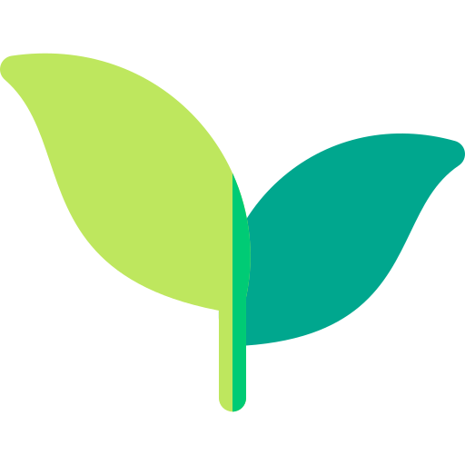
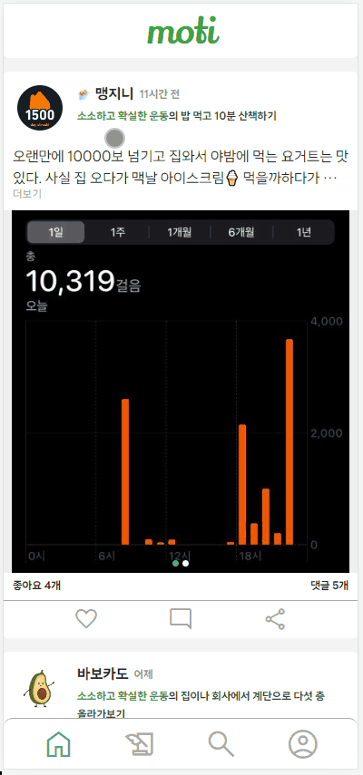
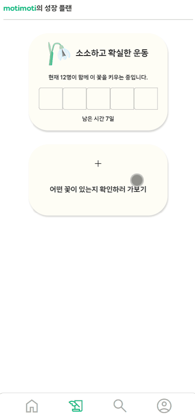
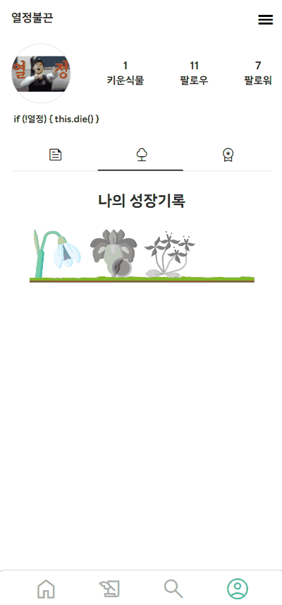
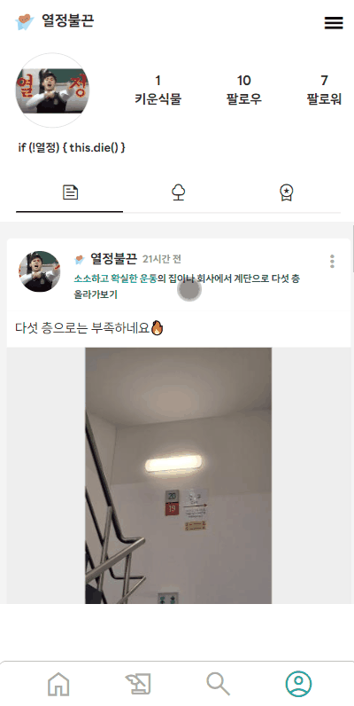
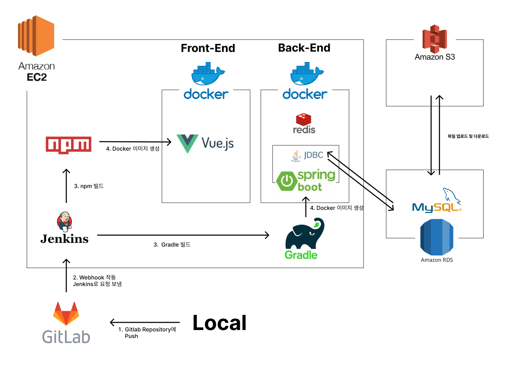

# moti - 동기부여가 필요한 당신을 위한 SNS

 

## **서비스 페이지: [https://moti.today/](https://moti.today/)**
 

## **서비스 소개 영상: [moti UCC](https://drive.google.com/file/d/1yH3LDSlq1AfVlKQXpxzwcc-TjYsNRSsW/view?usp=share_link)**

 

## **프로젝트 기간**
SSAFY 2학기 공통PJT(2023.01.03 ~ 2023.02.17)

 

## **서비스 개요**

우리는 늘 계획을 세웁니다. 나를 위해, 내가 사랑하는 사람들을 위해 우리는 계획을 세우고 그것을 해내기 위해 스스로 동기부여하지만 실천하는 것이 쉽지 않을 때가 많습니다. 피곤하다는 이유로 운동을 가지 않기도 하고, 바쁜 삶에 치여 부모님께 연락 한 통 드리지 못하곤 합니다. 우리는 목표의식은 있지만 실천하기 어려워하는 사람들을 위해 moti를 기획하게 되었습니다.

**moti는 우리의 내재적 동기를 증진하고, 미션 공동체감을 형성해주어 우리가 ‘실천이 습관이 되는 삶’을 살아갈 수 있도록 도울 것입니다.**

 

## **주요 기능**

### **성장 플랜 선택**
  - 하단 네비게이션바의 미션수행 탭에서 수행할 성장 플랜을 선택합니다.
  - 세 개의 큰 카테고리(건강, 관계, 행복) 안에 각각 2개의 성장 플랜이 들어있습니다. 사용자들은 각 성장 플랜을 구성하는 미션들을 확인한 뒤 자신이 원하는 성장 플랜을 최종적으로 선택합니다.
  - 모든 성장 플랜은 해당 성장 플랜의 취지를 가장 잘 나타내는 꽃말을 가진 꽃으로 대표됩니다.
  
    

### **미션 후기 피드 작성**
  - 미션을 수행하고 미션 후기 피드를 작성합니다.
  
    

### **피드 좋아요, 댓글 쓰기**
  - 사용자들이 올린 피드에 좋아요를 누를 수 있고, 댓글을 작성할 수 있습니다.
  
    
        
### **성장 플랜 피드 모아보기**
  - 수행한 성장 플랜의 피드를 프로필에서 한 눈에 확인할 수 있습니다.
  
    
        
### **업적(뱃지)**
  - 피드 작성 수, 등록한 댓글 수, 성장 플랜 완수 수 등 활동에 따라 뱃지가 주어집니다.
  - 획득한 뱃지 중 대표 뱃지를 설정하여 닉네임 옆에 띄울 수 있습니다.
  
    
        
### **검색**
  - 게시글, 성장 플랜, 계정 검색을 할 수 있습니다.
  
    

### **성장 플랜 건의**
  - 새로운 성장 플랜 아이디가 있다면 프로필의 ‘성장플랜 건의’함에서 성장 플랜과 그에 해당하는 미션을 제안할 수 있습니다.
  
    
        

### **기타 기능**
  - 회원가입/로그인: 일반(이메일 인증), 카카오톡, 구글
  - 프로필 수정: 닉네임, 프로필 사진, 자기 소개
  - 회원정보 수정: 비밀번호 변경, 회원 탈퇴
  - 팔로우: 프로필에서 팔로우, 팔로워 리스트 확인 가능

 

## **Architecture**
  

 

## **기술 스택**
  - 협업, 버전관리: 
  - 언어:  
  - FE/BE framework:  
  - DB: 
  - 배포: 
  - CI/CD:  
  - 디자인: 

 

## 프로젝트 산출물
  - [요구사항 명세서](https://docs.google.com/spreadsheets/d/1VCHoI7GupFWbiQet0yiWQ8CtMJXy55EqK7BFbsyXBNE/edit?usp=sharing)
  - [기능 정의서](https://docs.google.com/spreadsheets/d/1RU2K2406LPfLwlQ1BZtzjaTzlWlzKXkbtrGJGKwhSkg/edit?usp=sharing)
  - [와이어 프레임](https://www.figma.com/file/YNlhSos5Lc5T7x8kPRZ9Xa/wireframe?node-id=1%3A4&t=eUwB9h039oUJrfVB-1)
  - [ERD](https://drive.google.com/file/d/162xcVEjiTRk7FI0koiqdyPW6W22sieOB/view?usp=sharing)
  - [API 명세서](https://docs.google.com/spreadsheets/d/1duRRLAfNjpaQ-DNTC_Gr5_93S6W2WguajCkwFq1mzKk/edit?usp=sharing)
  - [UCC](https://drive.google.com/file/d/1yH3LDSlq1AfVlKQXpxzwcc-TjYsNRSsW/view?usp=share_link)
  - 최종 발표 자료
  - [포팅 매뉴얼](https://lab.ssafy.com/s08-webmobile2-sub2/S08P12A509/-/blob/master/exec/%ED%8F%AC%ED%8C%85%EB%A7%A4%EB%89%B4%EC%96%BC_A509_moti.pdf)
  - [서비스 기획서](https://docs.google.com/document/d/19p0VtpNlteqFQRUuHLccIS_PhBel7xTYJ-Y9FSJ4dSQ/edit?usp=sharing)
  - [유사 서비스 조사](https://docs.google.com/spreadsheets/d/1teaXvvrvGnj2uXY0SJvy8_VOWVV7pqUdUF4t35g7PZA/edit?usp=sharing)
  - [서비스 전략 구상 및 학습](  https://docs.google.com/document/d/1he7Bx1rYmBEvgwee7ZHUk5tWowbOb8AGEAZ-nKhbLx8/edit?usp=sharing)
  

 

## 팀원 소개

